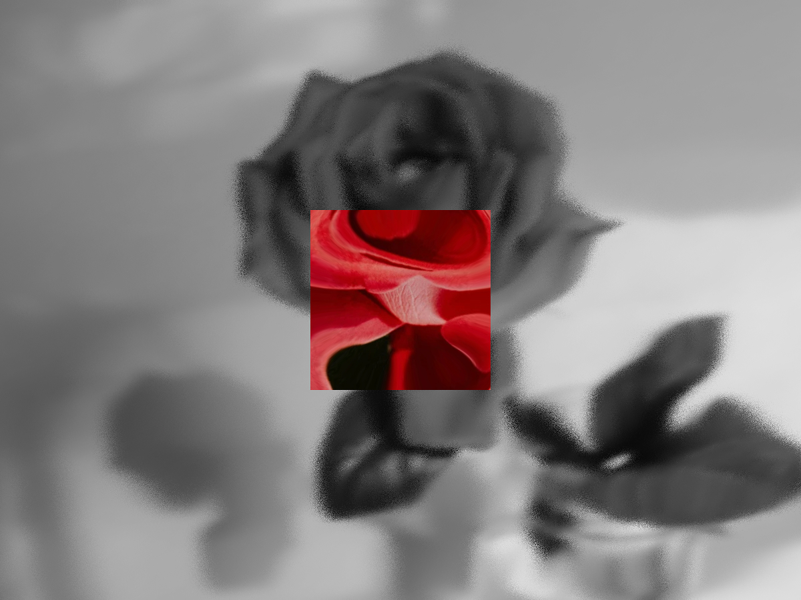

# Pointer Square Lens Distortion with RGB Shift

An interactive WebGL effect that follows the pointer with a square lens, switching between two textures while applying lens distortion, a radial RGB shift, waves, and animated grain.



[Article on Codrops]()

[Demo]()

## Features

- A pointer-following square mask that remains square across viewport aspect ratios
- Localized lens distortion inside the square
- A radial RGB shift that grows stronger toward the square's edges
- Independent inside and outside textures with cover-style UV mapping
- Animated sine-wave and pseudo-random displacement outside the square
- Live controls for the lens, wave, grain, and pointer easing parameters

## Installation

```bash
# Install dependencies
npm install

# Start development server
npm run dev

# Build for production
npm run build

# Preview the production build locally
npm run preview

```

## Credits

- Built with [Astro](https://astro.build/), [Three.js](https://threejs.org/), and [lil-gui](https://lil-gui.georgealways.com/)
- The `random3` GLSL function is based on [Nikita Miropolskiy's Shadertoy example](https://www.shadertoy.com/view/XsX3zB)
- Demo imagery uses [Red rose flower](https://unsplash.com/ja/%E5%86%99%E7%9C%9F/%E8%B5%A4%E3%81%84%E3%83%90%E3%83%A9%E3%81%AE%E8%8A%B1-Y7iHt3LRWGg) by [Kelly Sikkema](https://unsplash.com/@kellysikkema) on Unsplash

## Misc

Follow yuki: [X](https://x.com/yukiloz7), [GitHub](https://github.com/tomoyukinakata)

Follow Codrops: [X](https://www.x.com/codrops), [Facebook](https://www.facebook.com/codrops), [Instagram](https://www.instagram.com/codropsss/), [LinkedIn](https://www.linkedin.com/company/codrops/), [GitHub](https://github.com/codrops)

## License

[MIT](LICENSE)
